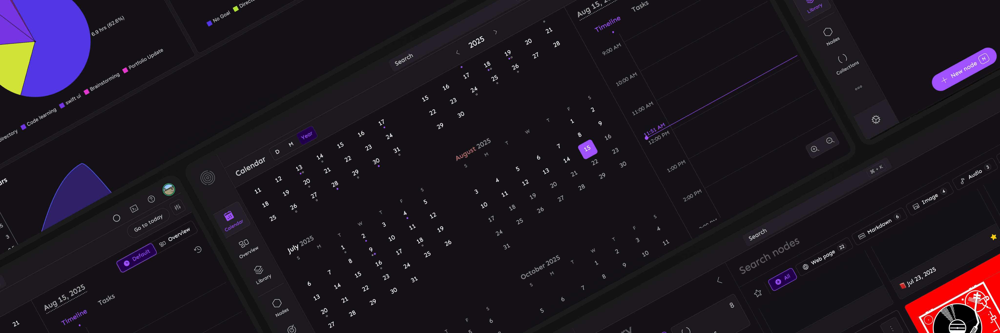

<div align="center">
  <h1>Tidigit</h1>
  <p>Tidy Digital Kit aka. Tidigit is an open source library that's powering tools built at <a href="https://21n.org">21n</a></p>
</div>

<div align="center">

[](/LICENSE)
[](https://discord.com/invite/9HJqKYTZKg)

</div>

# Tools
The below is the list of tools built using Tidigit library.

| Name | Website | Description | Topics
|------|---------|-------------|-------|
| Memotron | [memotron.app](https://memotron.app) | **Your memory atlas**, a tool for managing your knowledge. | PKM, Note taking, Knowledge management. |
| Pointron | [pointron.app](https://pointron.app) | **Your focus haven**, a tool for tracking goals and managing your time. | Focus, Time management |
| Nucleus | [nucleus.to](https://nucleus.to) | **Your digital harmony**, a tool for managing your digital life. This is a super app which is made by combining all the tools listed above. | Digital life, Personal productivity |

All of the above tools are intended for personal use and lacks collaboration, sharing, and other team features.

*More tools coming soon...*


# Self hosting
At the moment, only frontend app can be self-hosted on your own server. Therefore, it is not possible to sync your data between devices using self-hosted app. To self-host and access the offline-only frontend app using your own web URL - Please follow the instructions below.

1. Clone/Fork the [client](https://gitlab.com/21nOrg/client) repository
2. Set Environment Variables. Use any of `memotron`, `pointron`, or `nucleus` for `VITE_PRODUCT`
```
VITE_PRODUCT=memotron
VITE_STATIC_URL=https://cdn.21n.co
```
3. Deploy to the provider of your choice

# Contributing
We welcome contributions! Please see the [CONTRIBUTING](CONTRIBUTING.md) file for details.

The project is built with [SvelteKit](https://kit.svelte.dev/) and [TailwindCSS](https://tailwindcss.com/) for the frontend client, and [Node.js](https://nodejs.org/) for the backend.

---
### License
This project is licensed under the AGPL-3.0 license. See the [LICENSE](LICENSE) file for details.

### Contact
For any questions or feedback, please contact us at [hello@21n.org](mailto:hello@21n.org).

❤️ We extend our gratitude to all the [OSS libraries and tools](https://github.com/21nOrg/tidigit/network/dependencies) that made this project possible.