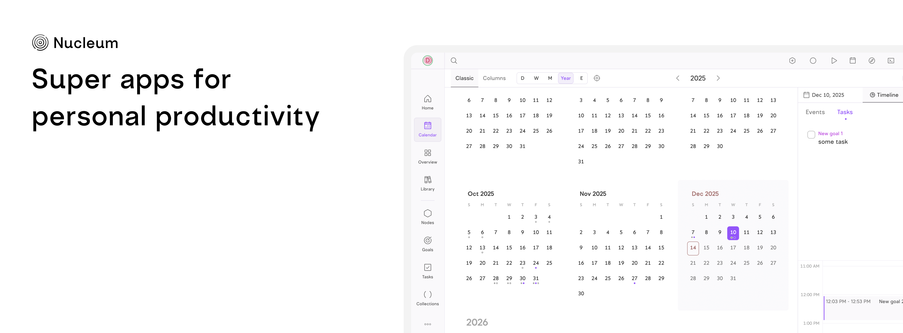

<div align="center">
  <h1>Nucleum</h1>
  <p>Meticulously crafted super apps to help you manage your digital life efficiently.</p>
</div>
  <p align="center">
    <a href="https://nucleum.app">Website</a>
    ·
    <a href="https://docs.nucleus.to">Documentation</a>
    ·
    <a href="https://docs.nucleus.to/roadmap">Roadmap</a>
  </p>
<div align="center">
<br />

[](/LICENSE)
[](https://github.com/21nOrg/nucleus/actions/workflows/tests.yml)
</div>

<div align="center">

[](https://discord.com/invite/9HJqKYTZKg)
[](https://www.youtube.com/@21nCo)
[](https://reddit.com/r/nucleus)
[](https://twitter.com/nucleumApp)


</div>


# Applications

| App      | Website                          | Description                                                                 |
|----------|----------------------------------|-----------------------------------------------------------------------------|
| Nucleum  | [nucleum.app](https://nucleum.app)     | **Your digital harmony**, a super app that combines all of the apps listed below in a cohesive manner.    |
| Memotron | [memotron.app](https://memotron.app) | **Your memory atlas**, a tool for managing your digital memory and personal knowledge.<br><br>Tags: Digital memory, PKM, Note‑taking, Knowledge management.                  |
| Pointron | [pointron.app](https://pointron.app) | **Your focus haven**, a tool for tracking your goals and managing your time.<br><br>Tags: Focus, Time tracking, Goals, Events and Task management.     |
| Fellotron | soon* | **Your communication manager**, a tool for managing your email and all of your communication in one place.     |
| Finatron | soon* | **Your money matters**, a tool for everything finance in your life.     |

*For early access to our new products - please join our Discord [here](https://discord.com/invite/9HJqKYTZKg).

**Note:** All of the above tools are designed for personal use and lack team/group features like collaboration, sharing, etc.


# Self hosting
Currently, only the frontend apps can be self‑hosted on your own server. This means you cannot sync data between devices when self‑hosting. To deploy the offline‑only frontend at your own URL, follow these steps.

1. Clone/Fork this repository
2. This is a turbo repo with `/apps` folder containing apps that can be deployed. Choose the app sub-folder corresponding to the app you want to run.
3. Set the environment variables.
4. Deploy to the provider of your choice

```env
VITE_PRODUCT={{memotron | pointron | nucleum }}
VITE_STATIC_URL=https://cdn.21n.co
```

*Full app deployment including backend will be available soon...*

# Contributing
We welcome contributions! Please see the [CONTRIBUTING](https://github.com/21nOrg/nucleus?tab=contributing-ov-file) file for details.

The project is built with 
- [SvelteKit](https://kit.svelte.dev/) and [TailwindCSS](https://tailwindcss.com/) for the frontend clients
- [Node.js](https://nodejs.org/) for the backend
- [Super functions](https://superfunctions.com) for Authentication, billing, communication and more

---
### License
This project is licensed under the AGPL-3.0 license. See the [LICENSE](LICENSE) file for details.

### Contact
For any questions, security reporting or feedback, please contact us at [hello@21n.org](mailto:hello@21n.org).

❤️ We extend our deepest gratitude to all the [OSS libraries and tools](https://github.com/21nOrg/nucleus/network/dependencies) that made this project possible.
